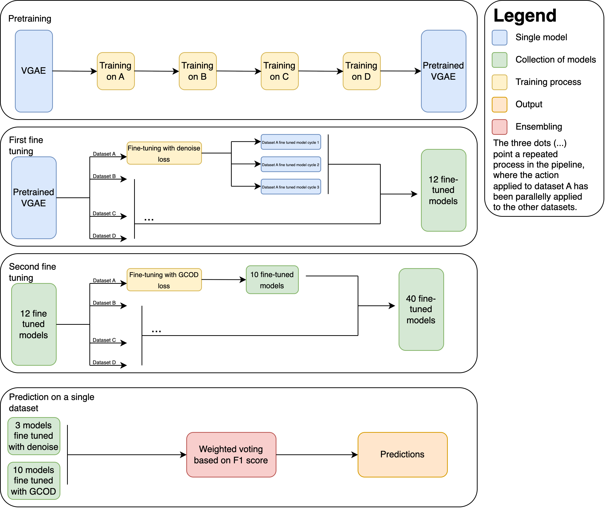

# Overview
Group name: OCCB  
Team:  
Olmo Ceriotti 2193258  
Clelia Bernardo 2001903

## Model Architecture

The core model used throughout is `EdgeVGAE`, a Variational Graph Autoencoder adapted for edge features and graph classification. 
This approach was inspired by this [method](https://github.com/cminuttim/Learning-with-Noisy-Graph-Labels-Competition-IJCNN_2025). The model has not been modified while the training process and losses used were drastically changed, including denoise loss and GCOD loss from this [paper](https://arxiv.org/abs/2412.08419).
It consists of:
*   `EdgeVGAEEncoder`: Uses custom GNN layers to produce node embeddings.
*   A reparameterization step to sample latent node features `z`.
*   `global_mean_pool` to get a graph-level embedding from node embeddings.
*   A `classifier` (Linear layer) for graph classification from the graph embedding.
*   Decoder components (`decode`) for reconstructing adjacency and edge attributes, used in `recon_loss` and `denoise_recon_loss`.
*   `kl_loss` for the VAE regularization.

## I. Initialization & Setup

1.  **Argument Parsing (`main.py`):**
    *   `--test_path` (required): Path to the test data (e.g., `data/A/test.json.gz`). Determines the target `dataset_char` (e.g., 'A').
    *   `--train_path` (optional): Path to the training data for the target dataset. If provided, the script enters training mode.
    *   `--external_pretrained_model` (optional): Path to a `.pth` model file to use as a starting point for fine-tuning, potentially skipping the iterative pretraining phase.
    *   `--base_output_dir` (optional, default: script directory): Directory for all outputs (logs, checkpoints, submission).
2.  **Logging:** Main orchestrator logging and GCOD-specific logging are set up.
3.  **Directory Creation:** Output subdirectories (`checkpoints`, `logs`, `submission`, `checkpoints_gcod`) are created if they don't exist.

## II. Training Phase (if `--train_path` is provided)

This phase aims to produce a set of well-tuned models for the target dataset.

### A. Iterative Pretraining (All Datasets A -> B -> C -> D)

*   **Purpose:** To learn general graph representations by sequentially pretraining on all available datasets (A, B, C, D).
*   **Process:**
    1.  The script iterates through all datasets ('A', 'B', 'C', 'D').
    2.  For each dataset:
        *   An `EdgeVGAE` model is initialized.
        *   If a model from a *previous iterative pretraining phase* exists (e.g., model from 'A' when pretraining 'B'), it's loaded. Otherwise, weights are initialized fresh.
        *   The model is trained on the `train.json.gz` data of the selected dataset using the same hyperparameters for each one.
        *   Training involves a standard classification loss, KL divergence loss, and reconstruction loss.
        *   The best model (based on validation F1 score, if validation data is available) or the model from the final epoch is saved.
*   **Output:** The pretrained model.
The external model takes precedence for subsequent fine-tuning.

### B. Standard Fine-tuning

*   **Purpose:** To adapt the pretrained model specifically to the target dataset.
*   **Process:**
    1.  The base model for fine-tuning is selected:
    2.  Training data for the target dataset is loaded and split into training and validation sets.
    3.  The system runs a configurable number of fine-tuning "cycles".
    4.  In each cycle:
        *   An `EdgeVGAE` model is initialized and loaded with weights from the chosen base model.
        *   The model is trained on the target dataset's training split.
        *   The best model from this cycle (based on validation F1) is saved.
*   **Output:** A set of fine-tuned models (one for each cycle) for the target dataset.

### C. GCOD Fine-tuning

*   **Purpose:** To further refine the models generated in the previous using the GCOD training strategy.
*   **Process:**
    1.  Models generated from the previous stage are identified.
    2.  For each of these source models:
        *   An `EdgeVGAE` model instance is created and its weights are loaded from the source model.
        *   Auxiliary parameters are initialized.
        *   The model and the auxiliary parameters are jointly optimized for a set number of epochs on the target dataset's training data. This involves:
            *   Updating model parameters using the modified cross-entropy and the KL divergence term.
            *   Updating the parameters using an error term.
        *   The GCOD-fine-tuned model is saved.
*   **Output:** GCOD-fine-tuned models.

## III. Ensemble Prediction Phase

This phase generates the final submission files.

### A. Ensemble Prediction

*   **Process:**
    1.  Test data for the target dataset is loaded.
    2.  For each model collected:
        *   The `EdgeVGAE` model is loaded from the checkpoint.
        *   The model's validation F1 score is retrieved. This F1 score is used for weighting.
        *   The model generates class predictions for all samples in the test set.
    3.  **Ensembling:**
        *   The F1 scores are exponentiated and normalized to get weights for each model.
        *   For each test sample, the final predicted class is determined by a weighted vote across all models' predictions for that sample. The class receiving the highest total weight is chosen.
*   **Output:**
    *   The final predictions are saved with columns "id" and "pred".

## IV. Notes

The whole process was run on a notebook alternating between Colab and Kaggle. The code present in this directory has been produced through the refactoring of said notebook to give it the requested format. We incurred in numerous problems on the previously stated platforms due to memory limitations and overall unreliability. The only material issue that affected our submission was the removal of the logs files, that were inadvertedly overwritten while training. Due to the extensive nature of all the training process, only the remaining files are included in the logs folder.